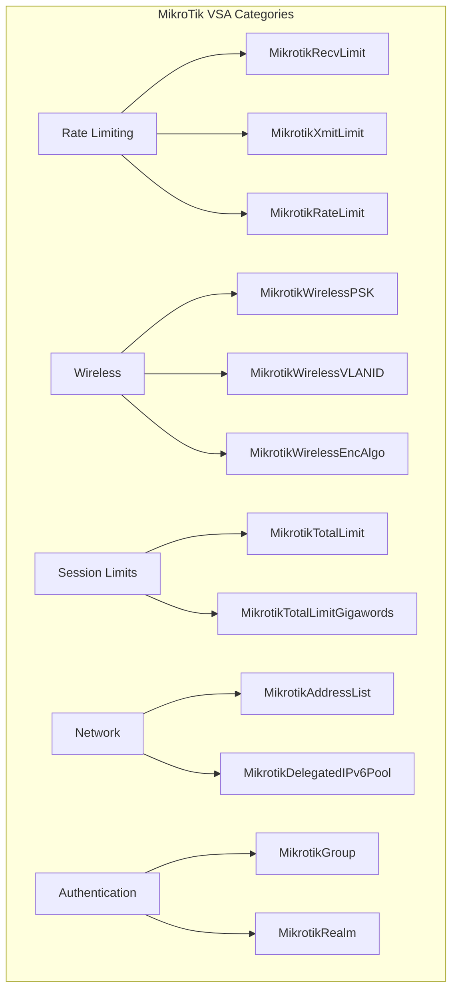
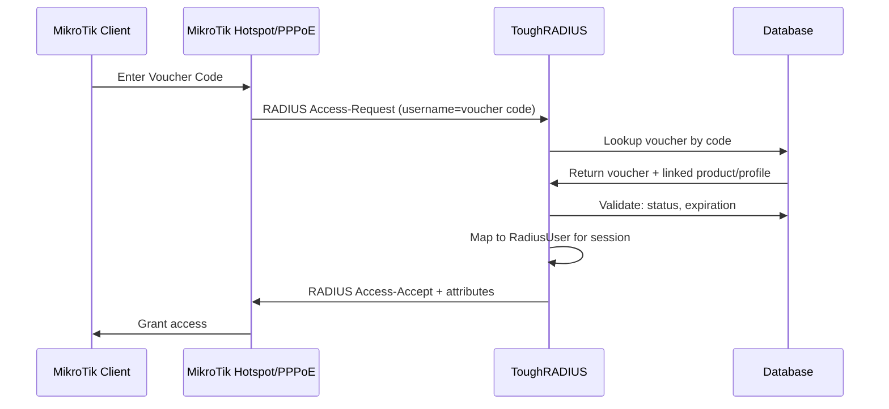
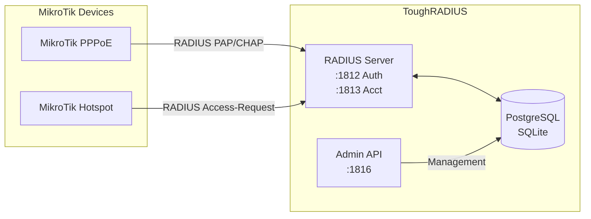

Now I have a comprehensive understanding of ToughRADIUS. Let me provide you with a detailed analysis:

---

# ToughRADIUS Capabilities and MikroTik Integration

## Overview

ToughRADIUS is a powerful, open-source RADIUS server designed for ISPs, enterprise networks, and carriers. It's built with Go and supports standard RADIUS protocols, RadSec (RADIUS over TLS), and includes a modern web management interface.

## Core Capabilities

| Capability | Description |
|------------|-------------|
| **RADIUS Protocol** | Full RFC 2865/2866 support for authentication and accounting |
| **RadSec** | TLS-encrypted RADIUS over TCP (RFC 6614) |
| **Multi-Vendor** | Cisco, MikroTik, Huawei, H3C, Juniper, Aruba, etc. |
| **High Performance** | Go-based with concurrent request handling |
| **Database** | PostgreSQL, SQLite (pure Go drivers) |
| **Management** | React-based admin interface with real-time monitoring |

## MikroTik Integration

ToughRADIUS has **comprehensive MikroTik support** through Vendor-Specific Attributes (VSAs). The MikroTik Vendor ID is **14988**.

### Supported MikroTik VSA Attributes (30+ attributes)

The system supports extensive MikroTik-specific attributes for controlling user sessions:



**Key MikroTik Attributes:**
- **Rate Limiting**: `MikrotikRecvLimit`, `MikrotikXmitLimit`, `MikrotikRateLimit` (supports format: `RX:256K TX:256K`)
- **Session Limits**: `MikrotikTotalLimit`, `MikrotikTotalLimitGigawords`
- **Group/Realm**: `MikrotikGroup`, `MikrotikRealm`
- **Wireless**: `MikrotikWirelessPSK`, `MikrotikWirelessVLANID`, `MikrotikWirelessEncAlgo`
- **Address Control**: `MikrotikAddressList` - for firewall address lists
- **IPv6**: `MikrotikDelegatedIPv6Pool`
- **DHCP**: `MikrotikDHCPOptionSet`, `MikrotikDHCPOptionParamSTR1/2`

## Voucher Authentication

ToughRADIUS implements voucher-based authentication as **prepaid time-limited accounts**:

### How Voucher Authentication Works



### Voucher Data Model

| Field | Description |
|-------|-------------|
| `Code` | The voucher value (used as username) |
| `RadiusUsername` | Mapped RADIUS username (populated on activation) |
| `Status` | unused, active, used, expired |
| `ExpireTime` | Expiration timestamp |
| `BatchID` | Group batch the voucher belongs to |

### Voucher Authentication Flow

1. **Voucher Presentation**: User enters voucher code in MikroTik login page
2. **RADIUS Request**: MikroTik sends Access-Request with voucher code as username
3. **Lookup**: ToughRADIUS looks up the voucher in database
4. **Validation**: Checks voucher status (not used/expired) and maps to user profile
5. **Attributes**: Returns MikroTik-specific attributes (rate limits, session timeout, etc.)
6. **Access Grant**: MikroTik grants access based on RADIUS response

The system includes a **MikroTik Hotspot login template** at [`web/public/mikrotik/login.html`](web/public/mikrotik/login.html) with QR code scanning support.

## Supported Profile Types

### ✅ PPPoE Support
- Authenticated via RADIUS using standard attributes
- Supports all MikroTik VSA attributes
- Bandwidth control via `MikrotikRateLimit`

### ✅ Hotspot Support  
- Integrated with MikroTik Hotspot login page
- Uses same RADIUS authentication mechanism
- Session timeout, data limits via VSA attributes

### Profile Configuration

Profiles (defined in [`internal/domain/radius.go`](internal/domain/radius.go)) include:

```go
type RadiusProfile struct {
    AddrPool       string    // Address pool name
    ActiveNum      int       // Concurrent sessions limit
    UpRate         int       // Upload rate (Kbps)
    DownRate       int       // Download rate (Kbps)
    BindMac        int       // MAC binding enabled
    BindVlan       int       // VLAN binding
    Domain         string    // Vendor-specific domain
    IPv6PrefixPool string    // IPv6 prefix pool
}
```

## Architecture Summary



## Summary

| Feature | Support |
|---------|---------|
| **MikroTik Integration** | ✅ Full support with 30+ VSA attributes |
| **PPPoE** | ✅ Supported |
| **Hotspot** | ✅ Supported |
| **Voucher Authentication** | ✅ Prepaid voucher system with expiration |
| **Rate Limiting** | ✅ Via MikroTik VSA attributes |
| **Session Control** | ✅ Concurrent sessions, time limits |
| **Bandwidth Control** | ✅ Per-user upload/download rates |
| **IPv6** | ✅ Via DelegatedIPv6Pool attribute |
| **MAC Binding** | ✅ Supported |
| **VLAN** | ✅ Supported |

ToughRADIUS is well-suited for ISP deployments using MikroTik equipment, supporting both PPPoE and Hotspot access methods with comprehensive voucher-based prepaid billing.
---

# ToughRADIUS Capabilities and MikroTik Integration

## Core Capabilities

**ToughRADIUS** is an open-source RADIUS server (Go-based) supporting:
- **RADIUS Protocol**: RFC 2865/2866 authentication & accounting
- **RadSec**: TLS-encrypted RADIUS over TCP (RFC 6614)
- **Multi-Vendor Support**: Cisco, MikroTik, Huawei, H3C, Juniper, Aruba, etc.
- **Database**: PostgreSQL, SQLite (pure Go drivers)
- **Admin Interface**: React-based web management

## MikroTik Integration

### Vendor-Specific Attributes (VSA)
ToughRADIUS supports **30+ MikroTik VSA attributes** (Vendor ID: 14988):

| Category | Attributes |
|----------|------------|
| **Rate Limiting** | `MikrotikRecvLimit`, `MikrotikXmitLimit`, `MikrotikRateLimit` |
| **Session Limits** | `MikrotikTotalLimit`, `MikrotikTotalLimitGigawords` |
| **Wireless** | `MikrotikWirelessPSK`, `MikrotikWirelessVLANID`, `MikrotikWirelessEncAlgo` |
| **Network** | `MikrotikAddressList`, `MikrotikDelegatedIPv6Pool` |
| **Authentication** | `MikrotikGroup`, `MikrotikRealm` |

### Voucher Authentication

Vouchers work as **prepaid time-limited accounts**:
1. User enters voucher code in MikroTik login (Hotspot) or PPPoE credentials
2. MikroTik sends RADIUS Access-Request with voucher code as username
3. ToughRADIUS validates voucher status/expiration and maps to user profile
4. Returns MikroTik-specific attributes (rate limits, session timeout)
5. MikroTik grants access based on RADIUS response

**Voucher data model** (from [`internal/domain/voucher.go`](internal/domain/voucher.go:26)):
- `Code` - voucher value used as username
- `Status` - unused, active, used, expired
- `ExpireTime` - expiration timestamp
- `BatchID` - batch group the voucher belongs to

Includes **MikroTik Hotspot login template** at [`web/public/mikrotik/login.html`](web/public/mikrotik/login.html) with QR code scanning support.

## Supported Profile Types

| Access Method | Support |
|--------------|---------|
| **PPPoE** | ✅ Supported |
| **Hotspot** | ✅ Supported |

Both use RADIUS authentication with MikroTik VSA attributes for:
- Bandwidth control (`UpRate`, `DownRate`)
- Concurrent sessions (`ActiveNum`)
- Address pool assignment (`AddrPool`)
- MAC/VLAN binding (`BindMac`, `BindVlan`)
- IPv6 prefix pools (`IPv6PrefixPool`)

## Summary

ToughRADIUS fully supports **PPPoE and Hotspot** access methods on MikroTik devices with comprehensive voucher-based authentication, rate limiting, session control, and bandwidth management through MikroTik Vendor-Specific Attributes.