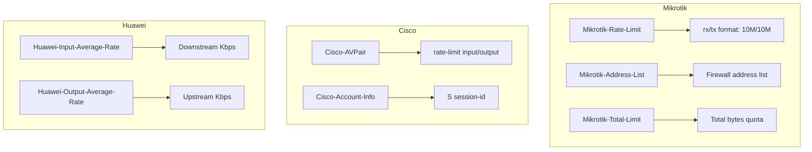
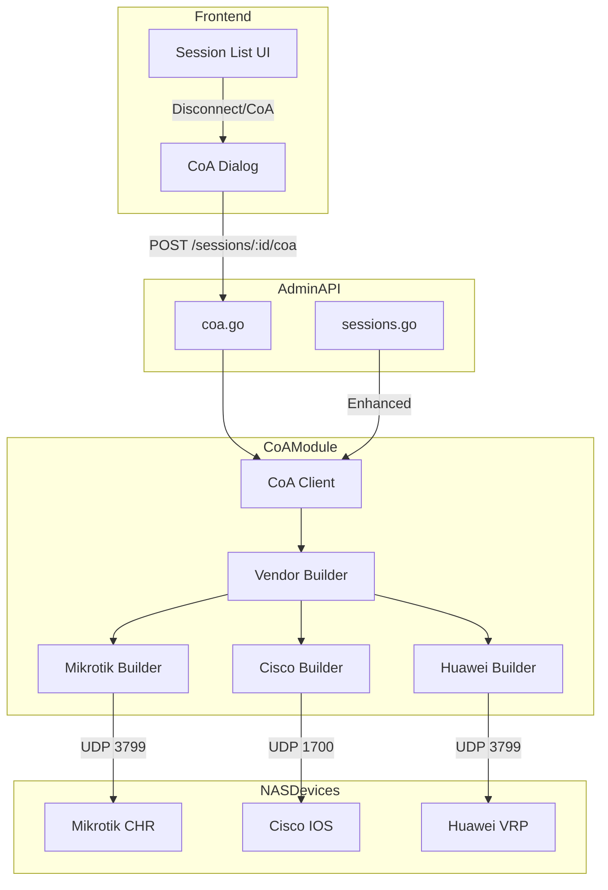

# CoA/PoD Enhancement Implementation Plan

## Overview

This document outlines the implementation plan for enhancing the Change of Authorization (CoA) and Packet of Disconnect (PoD) capabilities in ToughRADIUS, following RFC 3576 and vendor-specific implementations.

## Current State Analysis

### Existing Implementation

The current CoA implementation in [`internal/adminapi/sessions.go`](internal/adminapi/sessions.go:212-266) provides basic disconnect functionality:

```go
// DisconnectSession sends a CoA Disconnect-Request to the NAS
func DisconnectSession(c echo.Context, session domain.RadiusOnline) error {
    // Fetches NAS info, builds basic packet, sends to port 3799
    pkt := radius.New(radius.CodeDisconnectRequest, []byte(nas.Secret))
    rfc2866.AcctSessionID_SetString(pkt, session.AcctSessionId)
    rfc2855.UserName_SetString(pkt, session.Username)
    // ... sends to NAS
}
```

### Identified Gaps

1. **Hardcoded CoA Port**: Uses port 3799 instead of `NetNas.CoaPort` field
2. **No Vendor-Specific Attributes**: Missing Mikrotik, Cisco, Huawei-specific attributes
3. **No CoA-Request Support**: Only supports Disconnect-Request, not session modification
4. **Limited Error Handling**: No retry logic or detailed error reporting
5. **No Rate Limit Modification**: Cannot dynamically change user bandwidth

---

## MVP Breakdown

### MVP-1: CoA Client Foundation

**Goal**: Create a robust, reusable CoA/PoD client with proper configuration and error handling.

#### Files to Create

| File | Purpose |
|------|---------|
| `internal/radiusd/coa/client.go` | Core CoA client with configurable timeout, retry, and port |
| `internal/radiusd/coa/client_test.go` | TDD tests for client functionality |
| `internal/radiusd/coa/types.go` | Request/Response types and constants |

#### Key Components

```mermaid
classDiagram
    class CoAClient {
        +timeout time.Duration
        +retryCount int
        +retryDelay time.Duration
        +SendDisconnect(ctx, req DisconnectRequest) CoAResponse
        +SendCoA(ctx, req CoARequest) CoAResponse
    }
    
    class DisconnectRequest {
        +NASIP string
        +NASPort int
        +Secret string
        +Username string
        +AcctSessionID string
        +VendorCode string
        +VendorAttributes map[string]interface{}
    }
    
    class CoARequest {
        +NASIP string
        +NASPort int
        +Secret string
        +Username string
        +AcctSessionID string
        +VendorCode string
        +SessionTimeout int
        +UpRate int
        +DownRate int
        +VendorAttributes map[string]interface{}
    }
    
    class CoAResponse {
        +Success bool
        +Code radius.Code
        +Error error
        +Duration time.Duration
    }
    
    CoAClient --> DisconnectRequest
    CoAClient --> CoARequest
    CoAClient --> CoAResponse
```

#### Implementation Details

1. **CoA Client Configuration**
   - Read `CoaPort` from `NetNas` model (default: 3799)
   - Configurable timeout (default: 5s)
   - Retry logic with exponential backoff

2. **Packet Construction**
   - Standard RADIUS attributes (User-Name, Acct-Session-Id)
   - NAS identification attributes (NAS-IP-Address, NAS-Identifier)

3. **Response Handling**
   - Parse ACK/NAK responses
   - Log detailed error information
   - Return structured response with timing metrics

---

### MVP-2: Vendor-Specific Attribute Support

**Goal**: Add vendor-specific CoA attributes for Mikrotik, Cisco, and Huawei.

#### Files to Modify/Create

| File | Action | Purpose |
|------|--------|---------|
| `internal/radiusd/coa/vendor.go` | Create | Vendor attribute builder interface |
| `internal/radiusd/coa/vendor_mikrotik.go` | Create | Mikrotik-specific CoA attributes |
| `internal/radiusd/coa/vendor_cisco.go` | Create | Cisco-specific CoA attributes |
| `internal/radiusd/coa/vendor_huawei.go` | Create | Huawei-specific CoA attributes |
| `internal/radiusd/coa/vendor_test.go` | Create | TDD tests for vendor attributes |

#### Vendor Attribute Mapping



#### Implementation Details

1. **Vendor Interface**
   ```go
   // VendorAttributeBuilder defines the interface for vendor-specific CoA attributes
   type VendorAttributeBuilder interface {
       // AddRateLimit adds bandwidth rate limit attributes to the packet
       AddRateLimit(pkt *radius.Packet, upRate, downRate int) error
       
       // AddSessionTimeout adds session timeout attribute
       AddSessionTimeout(pkt *radius.Packet, timeout int) error
       
       // AddDisconnectAttributes adds vendor-specific disconnect attributes
       AddDisconnectAttributes(pkt *radius.Packet, session *domain.RadiusOnline) error
   }
   ```

2. **Mikrotik Implementation**
   - Use existing [`MikrotikRateLimit_SetString()`](internal/radiusd/vendors/mikrotik/generated.go:715) for rate limits
   - Format: `rx/tx` (e.g., `10M/10M` for 10Mbps up/down)
   - Support `Mikrotik-Address-List` for dynamic firewall rules

3. **Cisco Implementation**
   - Use Cisco-AVPair format: `rate-limit input 1024000 1024000 conform-action transmit exceed-action drop`
   - Support `Cisco-Account-Info` for session management

4. **Huawei Implementation**
   - Use `Huawei-Input-Average-Rate` (downstream) and `Huawei-Output-Average-Rate` (upstream)
   - Values in Kbps

---

### MVP-3: Admin API Integration

**Goal**: Expose CoA functionality through REST API endpoints.

#### Files to Modify/Create

| File | Action | Purpose |
|------|--------|---------|
| `internal/adminapi/coa.go` | Create | CoA-specific API handlers |
| `internal/adminapi/coa_test.go` | Create | API endpoint tests |
| `internal/adminapi/sessions.go` | Modify | Enhance existing disconnect with vendor support |
| `web/src/pages/Sessions/SessionList.tsx` | Modify | Add CoA UI controls |
| `web/src/components/CoADialog.tsx` | Create | Dialog for session modification |

#### API Endpoints

| Method | Endpoint | Description |
|--------|----------|-------------|
| POST | `/api/v1/sessions/:id/disconnect` | Disconnect user (enhanced) |
| POST | `/api/v1/sessions/:id/coa` | Modify session parameters |
| POST | `/api/v1/sessions/bulk-disconnect` | Bulk disconnect users |
| GET | `/api/v1/coa/status/:id` | Get CoA operation status |

#### Request/Response Examples

**Disconnect Request:**
```json
POST /api/v1/sessions/123/disconnect
{
  "reason": "admin_initiated",
  "notify_user": false
}
```

**CoA Request (Modify Session):**
```json
POST /api/v1/sessions/123/coa
{
  "up_rate": 20480,
  "down_rate": 51200,
  "session_timeout": 3600,
  "reason": "plan_upgrade"
}
```

**Response:**
```json
{
  "success": true,
  "message": "CoA request sent successfully",
  "nas_response": "ACK",
  "duration_ms": 45
}
```

---

## Architecture Diagram



---

## Test Strategy

### Unit Tests

1. **CoA Client Tests** (`client_test.go`)
   - Test packet construction with various attributes
   - Test timeout handling
   - Test retry logic
   - Test ACK/NAK response parsing

2. **Vendor Builder Tests** (`vendor_test.go`)
   - Test Mikrotik rate limit formatting
   - Test Cisco AVPair generation
   - Test Huawei attribute encoding

### Integration Tests

1. **Mock NAS Server**
   - Create a mock RADIUS server that responds to CoA requests
   - Test full request/response cycle

2. **End-to-End Tests**
   - Test API endpoint with database fixtures
   - Verify correct attributes are sent based on vendor

### Test Coverage Target

- `internal/radiusd/coa/`: **≥ 90%**
- `internal/adminapi/coa.go`: **≥ 80%**

---

## Implementation Checklist

### MVP-1: CoA Client Foundation
- [ ] Create `internal/radiusd/coa/types.go` with request/response types
- [ ] Write tests for CoA client in `internal/radiusd/coa/client_test.go`
- [ ] Implement `internal/radiusd/coa/client.go` with:
  - [ ] Configurable timeout and retry
  - [ ] `SendDisconnect()` method
  - [ ] `SendCoA()` method
  - [ ] Use `NetNas.CoaPort` instead of hardcoded port
- [ ] Run tests: `go test ./internal/radiusd/coa/... -v`

### MVP-2: Vendor-Specific Attributes
- [ ] Create `internal/radiusd/coa/vendor.go` with `VendorAttributeBuilder` interface
- [ ] Write tests for vendor builders in `internal/radiusd/coa/vendor_test.go`
- [ ] Implement `internal/radiusd/coa/vendor_mikrotik.go`:
  - [ ] Rate limit formatting (rx/tx)
  - [ ] Address list support
- [ ] Implement `internal/radiusd/coa/vendor_cisco.go`:
  - [ ] AVPair rate-limit format
  - [ ] Account-Info support
- [ ] Implement `internal/radiusd/coa/vendor_huawei.go`:
  - [ ] Input/Output average rate
- [ ] Run tests: `go test ./internal/radiusd/coa/... -v`

### MVP-3: Admin API Integration
- [ ] Create `internal/adminapi/coa.go` with API handlers
- [ ] Write API tests in `internal/adminapi/coa_test.go`
- [ ] Modify `internal/adminapi/sessions.go`:
  - [ ] Use new CoA client
  - [ ] Add vendor-specific attributes
- [ ] Register new routes in `registerSessionRoutes()`
- [ ] Create `web/src/components/CoADialog.tsx` for UI
- [ ] Modify `web/src/pages/Sessions/SessionList.tsx` with CoA controls
- [ ] Run tests: `go test ./internal/adminapi/... -v`
- [ ] Run frontend tests: `cd web && npm test`

---

## Dependencies

### Go Libraries (Already Available)
- `layeh.com/radius` - RADIUS protocol implementation
- `github.com/talkincode/toughradius/v9/internal/radiusd/vendors/*` - Vendor attribute generators

### No New External Dependencies Required
All functionality can be implemented using existing libraries. No CGO required.

---

## Verification Plan

### Automated Verification
```bash
# Run all tests
go test ./... -v

# Check coverage
go test ./internal/radiusd/coa/... -coverprofile=coverage.out
go tool cover -func=coverage.out | grep total

# Verify documentation
go doc internal/radiusd/coa
```

### Manual Verification
1. **Mikrotik CHR Test**:
   - Configure Mikrotik CHR with RADIUS
   - Connect a test user
   - Use API to disconnect user
   - Verify user is disconnected on Mikrotik

2. **Cisco IOS Test**:
   - Configure Cisco router with RADIUS
   - Connect a test user
   - Use API to modify rate limit
   - Verify rate limit change on Cisco

---

## Risk Assessment

| Risk | Impact | Mitigation |
|------|--------|------------|
| Vendor attribute format mismatch | High | Test with real devices, use vendor documentation |
| NAS timeout/unreachable | Medium | Implement retry logic, log errors clearly |
| CoA port varies by vendor | Low | Use `NetNas.CoaPort` field, provide defaults |
| Session not found on NAS | Medium | Handle NAK responses gracefully |

---

## References

- [RFC 3576](https://tools.ietf.org/html/rfc3576) - Dynamic Authorization Extensions to RADIUS
- [Mikrotik RADIUS Attributes](https://wiki.mikrotik.com/wiki/Manual:RADIUS_Client)
- [Cisco RADIUS CoA Configuration Guide](https://www.cisco.com/c/en/us/td/docs/ios-xml/ios/sec_usr_rad/configuration/15-mt/sec-usr-rad-15-mt-book/sec-rad-coa.html)
