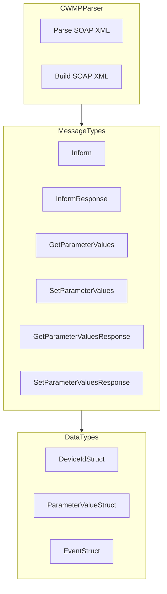
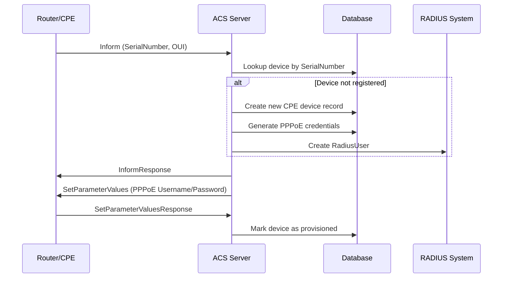
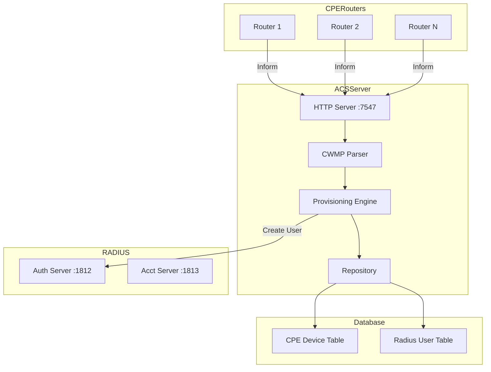

# TR-069 Auto Configuration Server (ACS) Implementation Plan

## Overview

This document outlines the implementation plan for a TR-069 CWMP (CPE WAN Management Protocol) Auto Configuration Server, following the AGENT.md principles of TDD, MVP, and code-as-documentation.

## TR-069 CWMP Protocol Background

TR-069 (Technical Report 069) is a technical specification from the Broadband Forum that defines the CPE WAN Management Protocol (CWMP). It enables remote management of customer premises equipment (CPE) such as routers, modems, and gateways.

### Key Protocol Features

1. **Transport**: HTTP/HTTPS with SOAP/XML messages
2. **Default Port**: TCP 7547 (ACS server)
3. **Authentication**: HTTP Basic or Digest authentication
4. **Connection Models**:
   - CPE-initiated (most common): CPE connects to ACS
   - ACS-initiated: ACS connects to CPE (requires connection request URL)

### CWMP Methods

| Method | Direction | Purpose |
|--------|-----------|---------|
| Inform | CPE → ACS | Periodic or event-driven status update |
| InformResponse | ACS → CPE | Acknowledge Inform |
| GetParameterValues | ACS → CPE | Read parameter values |
| GetParameterValuesResponse | CPE → ACS | Return parameter values |
| SetParameterValues | ACS → CPE | Write parameter values |
| SetParameterValuesResponse | CPE → ACS | Confirm parameter changes |
| GetParameterNames | ACS → CPE | Discover available parameters |
| Reboot | ACS → CPE | Reboot the device |
| FactoryReset | ACS → CPE | Reset to factory defaults |

### Standard Data Model Parameters

For PPPoE configuration:
- `InternetGatewayDevice.WANDevice.1.WANConnectionDevice.1.WANPPPConnection.1.Username`
- `InternetGatewayDevice.WANDevice.1.WANConnectionDevice.1.WANPPPConnection.1.Password`
- `InternetGatewayDevice.WANDevice.1.WANConnectionDevice.1.WANPPPConnection.1.ConnectionType`

For Wi-Fi configuration:
- `InternetGatewayDevice.LANDevice.1.WLANConfiguration.1.SSID`
- `InternetGatewayDevice.LANDevice.1.WLANConfiguration.1.PreSharedKey.1.PreSharedKey`
- `InternetGatewayDevice.LANDevice.1.WLANConfiguration.1.KeyPassphrase`

---

## MVP Breakdown

### MVP-1: TR-069 CWMP Protocol Parser

**Goal**: Parse and generate TR-069 SOAP/XML messages.

#### Files to Create

| File | Purpose |
|------|---------|
| `internal/acs/types.go` | CWMP data types and structures |
| `internal/acs/cwmp.go` | XML SOAP parser and generator |
| `internal/acs/cwmp_test.go` | TDD tests for CWMP parsing |

#### Key Components



#### Implementation Details

1. **XML Namespace Handling**
   ```xml
   <soap:Envelope xmlns:soap="http://schemas.xmlsoap.org/soap/envelope/"
                  xmlns:cwmp="urn:dslforum-org:cwmp-1-0">
   ```

2. **Inform Message Structure**
   ```go
   type Inform struct {
       DeviceId          DeviceIdStruct
       Event             []EventStruct
       ParameterList     []ParameterValueStruct
       MaxEnvelopes      int
       CurrentTime       time.Time
       RetryCount        int
   }
   
   type DeviceIdStruct struct {
       Manufacturer      string
       OUI               string  // Organization Unique Identifier
       ProductClass      string
       SerialNumber      string
   }
   ```

3. **Parameter Value Structure**
   ```go
   type ParameterValueStruct struct {
       Name              string
       Value             string
       Type              string  // xsd:string, xsd:int, xsd:boolean, etc.
   }
   ```

---

### MVP-2: Provisioning Engine

**Goal**: Automatically provision routers with PPPoE credentials and link to RADIUS users.

#### Files to Create

| File | Purpose |
|------|---------|
| `internal/acs/provision.go` | Auto-provisioning logic |
| `internal/acs/provision_test.go` | TDD tests for provisioning |
| `internal/acs/server.go` | HTTP server for CWMP endpoints |
| `internal/acs/repository.go` | Database operations |

#### Provisioning Flow



#### Database Model

```go
// CPEDevice represents a TR-069 managed device
type CPEDevice struct {
    ID              int64     `json:"id"`
    SerialNumber    string    `json:"serial_number"`    // Unique identifier
    OUI             string    `json:"oui"`              // Manufacturer OUI
    Manufacturer    string    `json:"manufacturer"`
    ProductClass    string    `json:"product_class"`
    
    // Provisioning status
    Status          string    `json:"status"`           // pending, provisioned, failed
    ProvisionedAt   *time.Time `json:"provisioned_at"`
    
    // RADIUS integration
    RadiusUserID    *int64    `json:"radius_user_id"`
    PPPoEUsername   string    `json:"pppoe_username"`
    PPPoEPassword   string    `json:"-"`                // Never expose in JSON
    
    // Connection info
    LastInform      *time.Time `json:"last_inform"`
    LastIP          string    `json:"last_ip"`
    ConnectionURL   string    `json:"connection_url"`   // For ACS-initiated
    
    CreatedAt       time.Time `json:"created_at"`
    UpdatedAt       time.Time `json:"updated_at"`
}
```

#### Provisioning Rules

1. **Auto-Discovery**: When a new CPE sends Inform, create device record
2. **Credential Generation**: Generate unique PPPoE username/password
3. **RADIUS Integration**: Create RadiusUser with generated credentials
4. **Configuration Push**: Use SetParameterValues to configure PPPoE

---

## Architecture Diagram



---

## Test Strategy

### Unit Tests

1. **CWMP Parser Tests** (`cwmp_test.go`)
   - Test Inform parsing from various router vendors
   - Test SetParameterValues generation
   - Test GetParameterValues generation
   - Test malformed XML handling

2. **Provisioning Tests** (`provision_test.go`)
   - Test auto-discovery flow
   - Test credential generation
   - Test RADIUS user creation
   - Test configuration push

### Integration Tests

1. **Mock CPE Server**
   - Simulate router Inform messages
   - Test full provisioning cycle

### Test Coverage Target

- `internal/acs/`: **≥ 80%**

---

## Implementation Checklist

### MVP-1: CWMP Protocol Parser
- [ ] Create `internal/acs/types.go` with CWMP data structures
- [ ] Write tests for Inform parsing in `internal/acs/cwmp_test.go`
- [ ] Implement `internal/acs/cwmp.go`:
  - [ ] `ParseInform()` method
  - [ ] `BuildInformResponse()` method
  - [ ] `BuildSetParameterValues()` method
  - [ ] `BuildGetParameterValues()` method
- [ ] Run tests: `go test ./internal/acs/... -v`

### MVP-2: Provisioning Engine
- [ ] Create `internal/acs/repository.go` with database operations
- [ ] Write tests for provisioning in `internal/acs/provision_test.go`
- [ ] Implement `internal/acs/provision.go`:
  - [ ] `AutoProvision()` method
  - [ ] `GeneratePPPoECredentials()` method
  - [ ] `LinkToRadiusUser()` method
- [ ] Create `internal/acs/server.go` with HTTP handlers
- [ ] Run tests: `go test ./internal/acs/... -v`

---

## Dependencies

### Go Libraries (Pure Go, No CGO)
- `encoding/xml` - Standard library for XML parsing
- `net/http` - Standard library for HTTP server
- `github.com/google/uuid` - UUID generation for session IDs

### No External Dependencies Required
All functionality can be implemented using standard library and existing project dependencies.

---

## Verification Plan

### Automated Verification
```bash
# Run all tests
go test ./internal/acs/... -v

# Check coverage
go test ./internal/acs/... -coverprofile=coverage.out
go tool cover -func=coverage.out | grep total
```

### Manual Verification
1. **Mock CPE Test**:
   - Send Inform message using curl or Postman
   - Verify ACS responds with InformResponse
   - Verify device is created in database

---

## References

- [TR-069 Amendment 6](https://www.broadband-forum.org/technical/download/TR-069_Amendment-6.pdf) - Official specification
- [TR-181 Data Model](https://www.broadband-forum.org/technical/download/TR-181_Issue-2_Amendment-13.pdf) - Device data model
- [CWMP SOAP Schema](urn:dslforum-org:cwmp-1-0) - XML namespace definition
